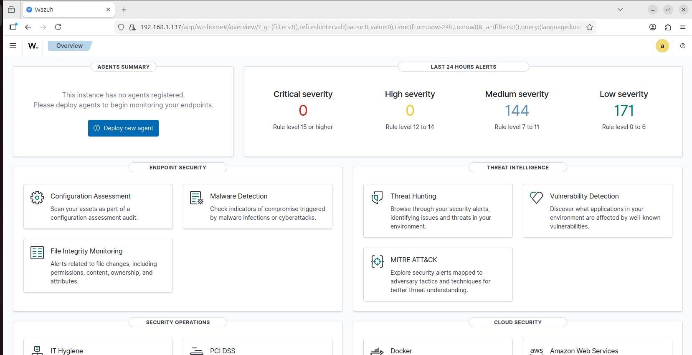
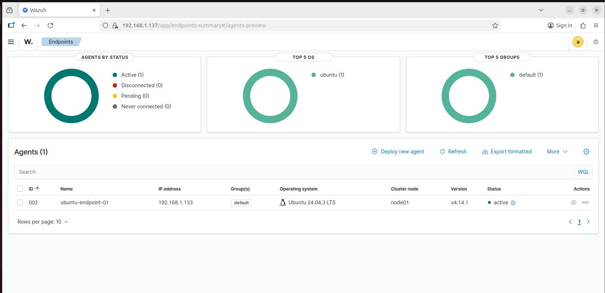
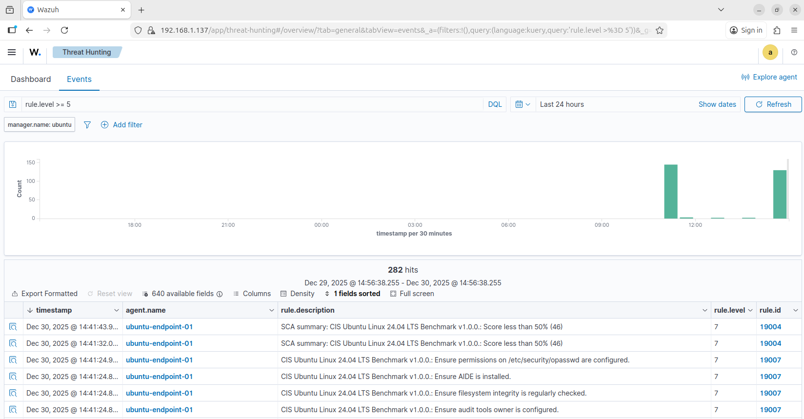
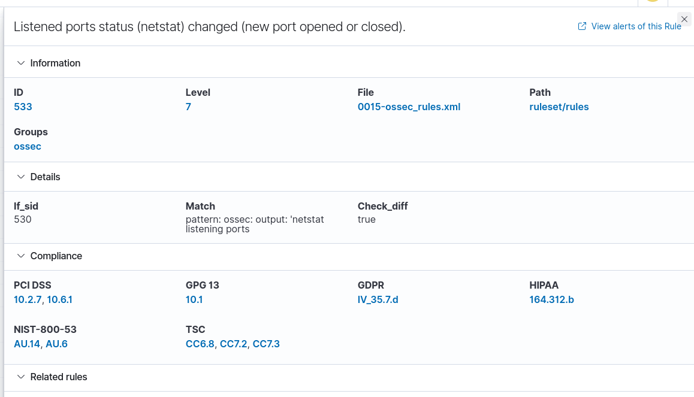

# Wazuh SOC Detection & Monitoring Lab

A hands-on SOC detection and monitoring lab using **Wazuh** to collect Linux endpoint telemetry, generate security alerts, investigate security-relevant activity, preserve evidence, and document analyst findings.

> This project was conducted in an isolated VMware lab environment for authorized cybersecurity training and detection validation.

---

## Project Objectives

The purpose of this project was to build and validate a practical SOC monitoring workflow rather than simply deploy a SIEM/HIDS platform.

The lab focused on:

- Deploying and configuring Wazuh endpoint monitoring
- Enrolling and validating a Linux endpoint agent
- Generating security-relevant endpoint activity
- Detecting privileged command execution
- Detecting changes in listening network services
- Monitoring file-system activity
- Reviewing alert severity and context
- Using MITRE ATT&CK mappings during analysis
- Exporting raw event evidence
- Documenting analyst observations

---

## Skills Demonstrated

- SOC monitoring and alert analysis
- Wazuh deployment and configuration
- Linux endpoint monitoring
- SIEM / HIDS operations
- Security-event triage
- Privileged activity monitoring
- File Integrity Monitoring
- Network service-change detection
- MITRE ATT&CK contextualization
- Evidence collection
- Event analysis
- Security reporting

---

## Lab Architecture

| Component | Role |
|---|---|
| Wazuh 4.14 | Security monitoring and alerting platform |
| Ubuntu 24.04 | Wazuh manager operating system |
| Ubuntu 24.04 | Monitored Linux endpoint |
| Wazuh Agent | Endpoint telemetry collection |
| VMware | Isolated virtualization environment |
| CSV Event Export | Raw alert evidence |

---

## Detection Workflow

1. Deploy Wazuh monitoring infrastructure
2. Configure the Linux endpoint agent
3. Verify agent connectivity
4. Generate security-relevant endpoint activity
5. Review Wazuh alerts
6. Analyze severity and event context
7. Review MITRE ATT&CK mappings where available
8. Preserve raw event evidence
9. Document analyst findings

---

## 1. Wazuh Environment

The Wazuh environment was configured to monitor an Ubuntu Linux endpoint inside an isolated VMware lab.

The dashboard provided centralized visibility into monitored endpoint activity.

---

## 2. Endpoint Agent Deployment

The Wazuh agent was configured on the monitored Ubuntu endpoint.

[View Agent Configuration](evidence/screenshots/02-agent-configuration.png)

The service was enabled and verified as operational.

[View Enabled Agent](evidence/screenshots/03-agent-enabled.png)

The endpoint successfully connected to the Wazuh manager and reported as an active agent.

This confirmed that endpoint telemetry could be collected and analyzed by the Wazuh manager.

---

## Key Detection Scenarios

The lab generated and analyzed several types of security-relevant endpoint activity.

| Detection | Security Relevance |
|---|---|
| Privileged `sudo` Activity | Identifies administrative or elevated command execution |
| Listening Port Changes | Detects changes to exposed network services |
| File Integrity Monitoring | Detects file creation, modification, or deletion |
| MITRE ATT&CK Mapping | Provides investigation context for selected alerts |

---

## Detection 1 — Privileged Access Activity

Wazuh recorded privileged Linux activity generated through `sudo`.

Privileged command execution is important SOC telemetry because administrative activity can represent either legitimate system administration or unauthorized privilege use.

### Analyst Assessment

The alert demonstrated that privileged activity could be collected and surfaced for analyst review.

In a production environment, an analyst would correlate the event with:

- User identity
- Command executed
- Authentication source
- Timestamp
- Related process activity
- Change-management records
- Additional alerts from the endpoint

The presence of privileged activity alone does not prove malicious behavior. Context is required before classifying an event as suspicious or malicious.

---

## Detection 2 — Listening Port Change

Wazuh generated an alert after detecting a change in the endpoint's listening network ports.

The observed alert included:

| Field | Value |
|---|---|
| Wazuh Rule ID | 533 |
| Severity | 7 — Medium |
| Description | Listening ports status changed |
| MITRE ATT&CK | T1046 — Network Service Discovery |

Changes to listening network services can result from:

- Newly installed software
- Service configuration changes
- Administrative activity
- Unexpected applications
- Remote-access services
- Potential persistence mechanisms

### Analyst Assessment

The alert successfully demonstrated Wazuh's ability to identify changes in network-service exposure.

In a production investigation, follow-up analysis would include identifying:

- Associated process
- Executable path
- Listening port
- Service owner
- User context
- Whether the activity matched an approved system change

---

## Detection 3 — File Integrity Monitoring

The environment also demonstrated Wazuh File Integrity Monitoring capabilities.

Observed activity included:

- File creation
- File deletion
- File-system change detection

File Integrity Monitoring can help identify unexpected changes to sensitive system files, application content, configuration files, and other monitored locations.

### Analyst Assessment

File-system events should be correlated with:

- File path
- User responsible for the change
- Associated process
- File hash
- Modification time
- Change-management records

A detected change represents security-relevant telemetry, but does not automatically mean that unauthorized activity occurred.

---

## MITRE ATT&CK Context

The listening-port alert included a mapping to:

**T1046 — Network Service Discovery**

MITRE ATT&CK mappings provide useful investigation context, but the presence of an ATT&CK technique mapping does not prove that an attack occurred.

Analysts should combine ATT&CK context with endpoint telemetry, process execution, network activity, authentication records, and organizational context.

---

## Raw Event Evidence

Wazuh alert data was exported for additional analysis and evidence preservation.

### [View Wazuh Alert Event Export](evidence/events/wazuh-alert-events.csv)

Retaining raw event data provides stronger evidence than screenshots alone and allows analysts to perform further filtering, correlation, and investigation.

---

## SOC Detection & Event Analysis Report

A separate analyst report documents the detection scenarios and investigation observations from this lab.

### [View SOC Detection & Event Analysis Report](reports/soc-detection-analysis.md)

The report includes:

- Environment details
- Detection analysis
- Alert context
- MITRE ATT&CK mapping
- Analyst observations
- Evidence references
- SOC investigation principles

---

## SOC Analysis Principles Demonstrated

This project reinforced several important SOC concepts:

- An alert is not automatically an incident.
- Detection requires analyst context.
- Privileged activity should be monitored even when legitimate.
- Changes in exposed network services warrant review.
- File-system changes can provide valuable endpoint telemetry.
- MITRE ATT&CK assists investigation but does not prove malicious activity.
- Raw evidence should be retained alongside screenshots.
- Analysts should document both confirmed observations and remaining unknowns.

---

## Evidence

Complete supporting evidence is available in:

### [View Assessment Evidence](evidence/)

Evidence includes:

- Wazuh dashboard
- Endpoint agent configuration
- Agent service status
- Active agent connectivity
- Privileged activity detection
- Listening-port detection
- Raw Wazuh event export

---

## Tools Used

| Tool | Purpose |
|---|---|
| Wazuh 4.14 | SIEM / HIDS monitoring and alert analysis |
| Wazuh Agent | Endpoint telemetry collection |
| Ubuntu 24.04 | Manager and monitored endpoint |
| VMware | Isolated lab virtualization |
| Linux Audit / System Telemetry | Endpoint activity generation and analysis |

---

## Lessons Learned

This project reinforced several practical SOC and detection-engineering concepts:

- Successful monitoring begins with reliable endpoint telemetry.
- Alerts require analyst validation and context.
- Security monitoring should include privileged activity.
- Changes to exposed network services can indicate meaningful security events.
- File integrity monitoring provides valuable visibility into endpoint changes.
- ATT&CK mappings are investigation aids rather than proof of compromise.
- Raw event exports strengthen evidence preservation.
- Detection, triage, investigation, and reporting are separate stages of the SOC workflow.

---

## Disclaimer

This project was conducted exclusively in a controlled cybersecurity lab environment.

The activity documented in this repository was generated for authorized security monitoring, detection validation, and professional development purposes.

No real-world compromise is represented by the events shown in this project.
